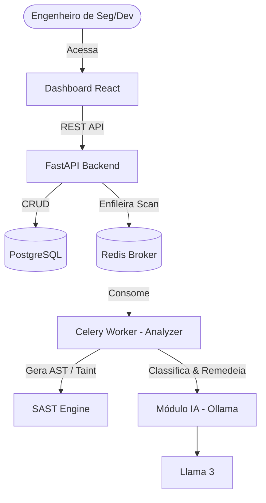

# Arquitetura da Plataforma SAST

## Visão Geral (C4 Model - Nível 1)
O sistema opera como uma plataforma de segurança orquestrada por filas, isolando a análise intensa de CPU (AST/Taint) e GPU (Ollama) da API pública.

## Componentes
1. **API (FastAPI):** Recebe webhooks do GitHub, gerencia estado do scan e persiste resultados.
2. **Analyzer (SAST Engine):** Faz o clone do repositório em disco efêmero, constrói a árvore de sintaxe (AST) com `ast` ou `tree-sitter` e aplica 15 heurísticas nativas + Taint Analysis.
3. **AI Module:** Enriquecimento contextual. Lê o finding bruto (linha, severidade presumida, trecho de código) e prompta o LLM local para filtrar Falsos Positivos e sugerir um código de correção (Remediation).
4. **DevSecOps (GitHub Actions):** O arquivo `devsecops.yml` cria um pipeline que consome Semgrep local e envia triggers para esta plataforma, bloqueando o Pull Request se a severidade for Critical.

## Segurança
- O tráfego para a API deve ser protegido via API Keys ou OAuth2 (a ser habilitado).
- Os repositórios analisados são limpos (`shutil.rmtree`) imediatamente após a extração da AST, impedindo vazamento local de PI (Propriedade Intelectual).
